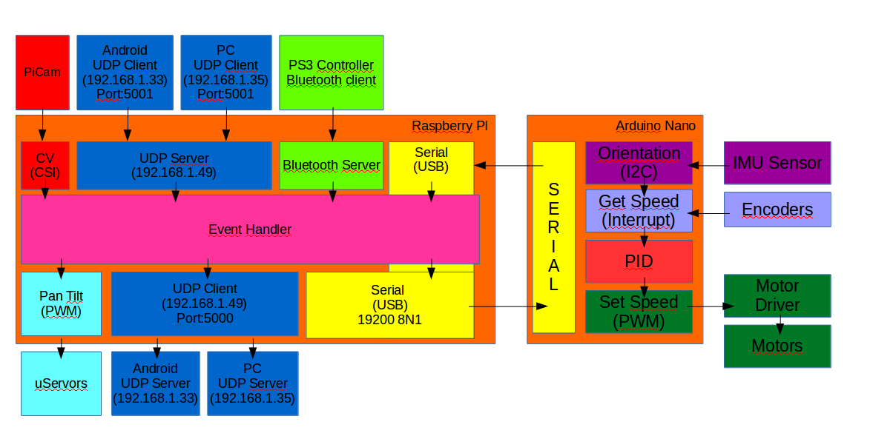

# Mr. Robot
_DIY study project_

## Description
Mr. Robot is an amazing TV series \o/, but also it is a DIY project based on the self balance robot concept using sensors to get orientation (pitch, roll and yaw) and PID controller to set the motor speed. Beside that, there are some additional features like wireless controllers by IP or bluetooth clients, computer vision functions like object tracking, video streaming to be used such as Google Cardboard VR for Android application and upcoming features.

## Study topics
This project is based on the following topics:
* Raspberry PI     
* Linux OS
* Python programming
* C++ programming
* Multithread/Multiprocess programming
* Robotics concepts
* IMU sensor fusion
* Computer Vision
* Communication protocols (UART, I2C, SPI, TCP, UDP...)
* Android app (*)
* PyQT

## Item list
* Raspberry Pi 3
* Arduino Nano Atmega328
* PiCam
* Pan/Tilt kit with micro servo 9g
* IMU GY80 10DOF sensor
* Ultrasonic HC-SR04 sensor (*)
* DC gearmotor 29:1 with encoder 12V 365RPM 8KgF.cm 
* Shaft coupler
* Wheels 1/8 buggy
* VNH2SP30 motor driver (H-bridge)
* LiPo battery 3S 11.1 2200mAh
* DC-DC Step down converter
* Bluetooth dongle
* WiFi dongle   
* Google Cardboard VR (*)
* Screws, nuts and bolts
* Acrylic frames 20x15x8cm

(*) TBD 

## External tools
* Opencv: http://opencv.org/
* pySerial: https://github.com/pyserial/pyserial
* PyQt5: https://sourceforge.net/projects/pyqt/
* PyOpenGL: http://pyopengl.sourceforge.net/
* matplotlib: http://matplotlib.org/
* PS3 Bluetooth Controller driver: http://qtsixa.sourceforge.net/
* Servoblaster: https://github.com/richardghirst/PiBits/tree/master/ServoBlaster
* PlatformIO: http://platformio.org/
* Atom IDE: https://atom.io/

